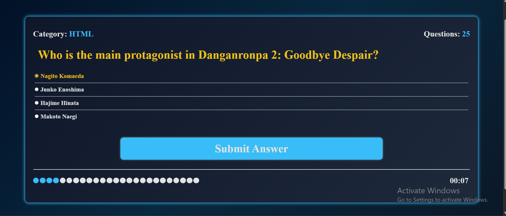
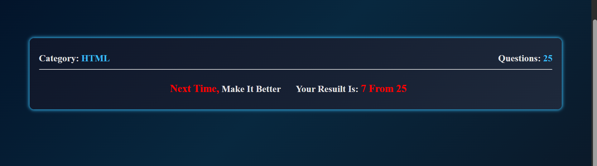

# 🧠 Quiz App

An interactive Quiz Application built with **HTML, CSS, and JavaScript**.
The app fetches general knowledge questions from an API and provides a timed quiz experience with score tracking.

---

## 🚀 Live Demo

🔗 https://lustrous-lebkuchen-b34708.netlify.app/

---

## 📸 Preview

### 🟢 Start Screen


### ❓ Question Screen



### 📊 Score Screen



---

## ✨ Features

* 🎯 General knowledge questions from API
* ⏱️ Timer for each question
* 📊 Score system (final result shown)
* 🔀 Randomized answers
* ⚠️ Error handling if API fails
* 🧠 Multiple choice questions

---

## ⚠️ Note

> This project is **not fully responsive yet** (optimized for desktop).

---

## 🛠️ Technologies Used

* HTML5
* CSS3
* JavaScript (Vanilla JS)
* Open Trivia API

---

## 📂 Project Structure

```
Quiz-App/
│── index.html
│── style.css
│── main.js
│── assets/
│   ├── image1.png
│   ├── image2.png
│   └── image3.png
```

---

## ⚙️ How It Works

1. Click **Start Quiz**
2. Questions are fetched from API
3. Each question has a countdown timer
4. Choose an answer and submit
5. Final score is displayed at the end

---

## 🧑‍💻 Author

**Anass Kafafy**
Front-End Developer (Learning Phase)

---

## ⭐ Support

If you like this project, give it a ⭐ on GitHub!
